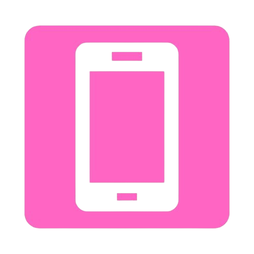

<h1> Hi, I'm Fer Sánchez</h1>

<!--
Here are some ideas to get you started:

- 🔭 I’m currently working on ...
- 🌱 I’m currently learning ...
- 👯 I’m looking to collaborate on ...
- 🤔 I’m looking for help with ...
- 💬 Ask me about ...
- 📫 How to reach me: ...
- 😄 Pronouns: ...
- ⚡ Fun fact: ...
-->

 

<h2>About me </h2>

• My complete name is María Fernanda Sánchez Valverde  
• Knowledge about backend, frontend, databases and data analysis  
• Passionate in the graphic/web design and UX/UI  
• I'm currently learning about Ruby on rails  
• I'm deeply interested in working with you, this <a href="Resume - Ma Fernanda Sanchez - Developer.pdf" target="_blank">resume</a> to know more about me!  
 

<h2>Skills</h2>
<h4>Front-end</h4>

  
  
  
  

<h4>Back-end</h4>

  
  
  
  
  
  

<h4>Databases</h4>

  
  
  
  
  

<h4>Data analysis & BI tools</h4>

  
  
  
  

  
<h4>Development tools</h4>

  
  
  
  

<h4>Design tools</h4>

  
  
  
  

 

<h2>Contact me </h2>

  
    
    

